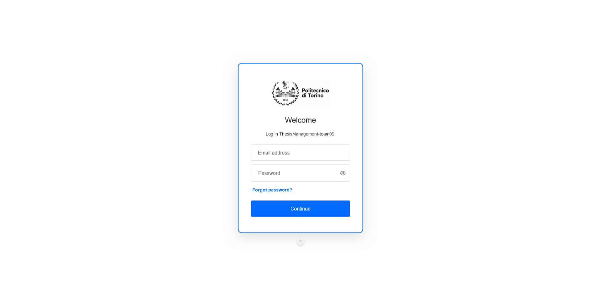
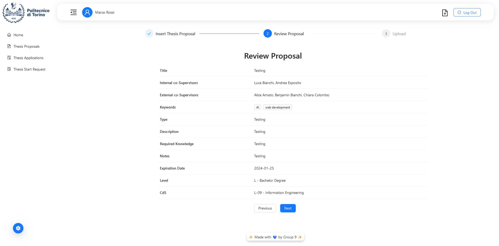
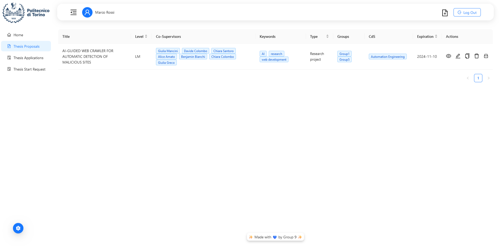
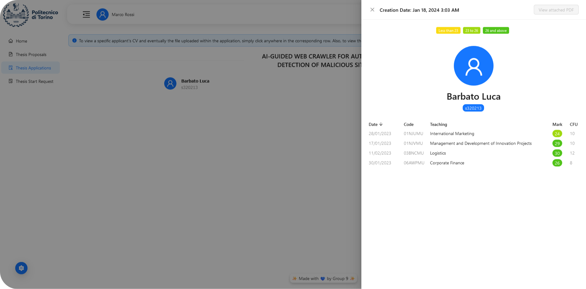
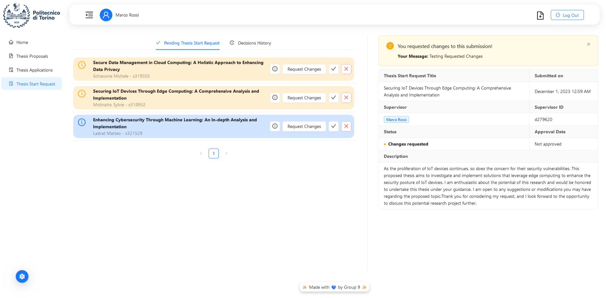
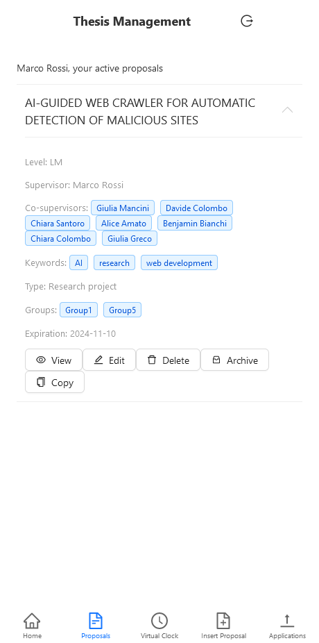
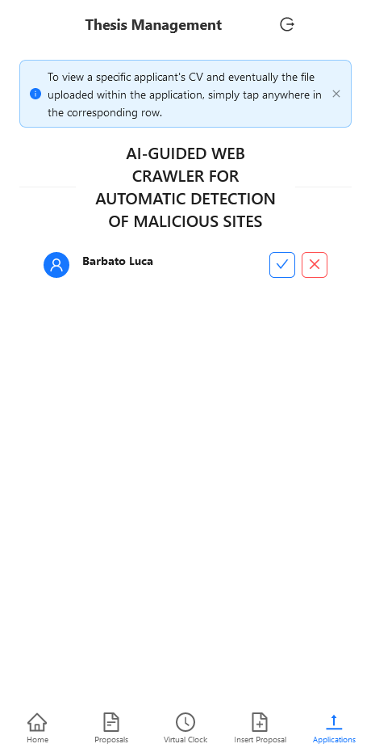
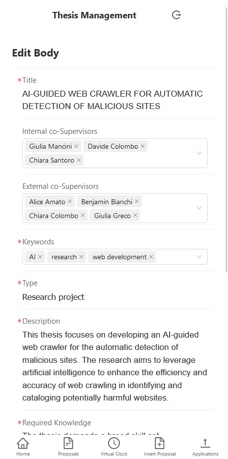

<html>
  

    

      
    

    

      
      
      
    

    

    <h1>Thesis Management System</h1>
    

    

      <a href="#overview">Overview</a>
      </li> | <a href="#how-to-run">How to run the project</a>
      </li> | <a href="#frontend-documentation">Frontend Documentation</a>
      </li> | <a href="#backend-documentation">Backend Documentation</a>
      </li> | <a href="#database-documentation">Database Documentation</a>
      </li> | <a href="#contributors">Contributors</a>
    

    

      
      
      
    

    

      
    

  

  

    <h2>Overview</h2>
    <h3>Welcome to our project! We're thrilled to have you here.</h3>
    
We are Group 9, and we're excited to present our innovative software designed to simplify the lives of students and teachers!

    
Our software offers a comprehensive suite of features, including the ability to create and manage thesis proposals, submit and handle student application, and generate and manage thesis start requests. It also comes with a stunning integrated email notification system and a visually appealing mobile interface for convenience and ease of use!

    

      
      
    

    

      
      
    

    

      
      
    

    

      
      
      
    

  

  

    <h2>How to run the Project</h2>
    

      <a href="#env-variables">Set up environmental variables</a>
      </li> | <a href="#backend">Backend Setup</a>
      </li> | <a href="#frontend">Frontend Setup</a>
      </li> | <a href="#docker">Use Docker</a>
    

  

  

    <h3>Set up environmental variables</h3>
    In order to work properly, the application requires the following environment variables to be set:

  - `TM_SMTP_SERVICE_NAME` = The name of the SMTP service to use (e.g. "gmail")
  - `TM_SMTP_HOST` = The host of the SMTP service to use (e.g. "smtp.gmail.com")
  - `TM_SMTP_USERNAME` = The username of the SMTP service to use (e.g. the email address for a Gmail account)
  - `TM_SMTP_PASSWORD` = The password of the SMTP service to use
  - `TM_SMTP_PORT` = The port of the SMTP service to use (e.g. 587)
  - `TM_SMTP_SECURE` = Whether to use a secure connection to the SMTP service (e.g. "true")

  ⚠️ _The service supports the use of dotenv-vault and therefore allows you to set only one environment variable: `TM_DOTENV_KEY`. This variable must contain the key to decrypt the environment variables stored in the dotenv-vault file._
  

  ---

  

    <h3>Backend Setup</h3>
    
Execute the following commands in a Command Shell:

    

      <code>cd backend</code> - Enter the folder
    

    

      <code>npm install</code> - Install all the dependencies
    

    

      <code>npm start</code> - Start the server
    

    
⚠️ <em>If you don't have npm installed you can download it from here: <a href="https://www.npmjs.com/get-npm">npm</a>
      </em>
    

  

  
  ---
  
  

    <h3>Frontend Setup</h3>
    
Execute the following commands in a Command Shell:

    

      <code>cd front-end</code> - Enter the folder
    

    

      <code>npm install</code> - Install all the dependencies
    

    

      <code>npm run build</code> - Build the project for production
    

    

      <code>npm run preview</code> - Preview the production build
    

    
⚠️ <em>If you don't have npm installed you can download it from <a href="https://www.npmjs.com/get-npm">here</a>
      </em>
    

  

  
  ---
  
  

    <h3>Docker</h3>
    
This project supports the use of Docker to run the application. Beware that you still need to set up <a href="#env-variables">environmental variables</a>. The following instructions assume that you already have Docker correctly installed on your machine: 

    

      <code>docker build -t apokalypt/09_thesis_management .</code> - Build the image
    

    

      <code>docker run -p 5173:5173 -p 3000:3000 --name thesis_management -e <...> apokalypt/09_thesis_management </code> - Run the container
    

    

      <code>npm run build</code> - Build the project for production
    

    

      <code>npm run preview</code> - Preview the production build
    

    
⚠️ <em>A working image is available on <a href="https://hub.docker.com/r/apokalypt/09_thesis_management">Docker Hub</a>
      </em>
    

  

  

    <h2>Frontend Documentation</h2>
    
For a more datailed documentation regarding the Frontend, please <a href="https://github.com/therossee/ThesisManagement-Group09/tree/main/front-end">read here</a>
    

  

  

    <h2>Backend Documentation</h2>
    
For a more datailed documentation regarding the Backend, please <a href="https://github.com/therossee/ThesisManagement-Group09/tree/main/backend">read here</a>
    

  

  

    <h2>Database Documentation</h2>
    
For a more datailed documentation regarding the Backend, please <a href="https://github.com/therossee/ThesisManagement-Group09/tree/main/database">read here</a>
    

  

  

    <h2>Contributors</h2>
    

      <a href="https://github.com/lucabubi">Barbato Luca (320213)</a>
      </li> | <a href="https://github.com/Pancasx">Beltrán Juan Carlos (321607)</a>
      </li> | <a href="https://github.com/therossee">De Rossi Daniele (314796)</a>
      </li> | <a href="https://github.com/DianaHus">Husanu Diana Alexandra (318771)</a>
      </li> | <a href="https://github.com/Apokalypt">Ladrat Mattéo (321529)</a>
      </li> | <a href="https://github.com/Sylvie-Molinatto">Molinatto Sylvie (318952)</a>
      </li> | <a href="https://github.com/micheleschiavone00">Schiavone Michele (319355)</a>
    

  

</html>