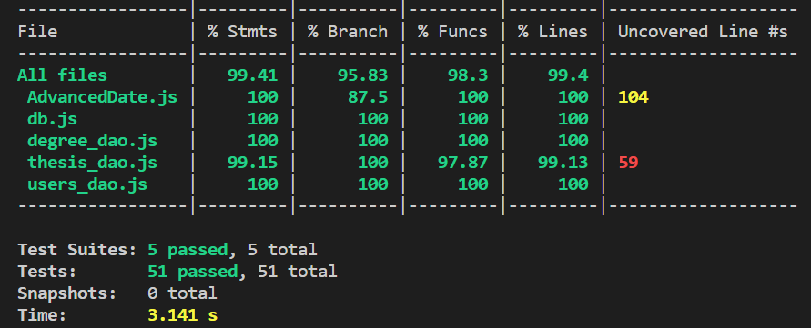
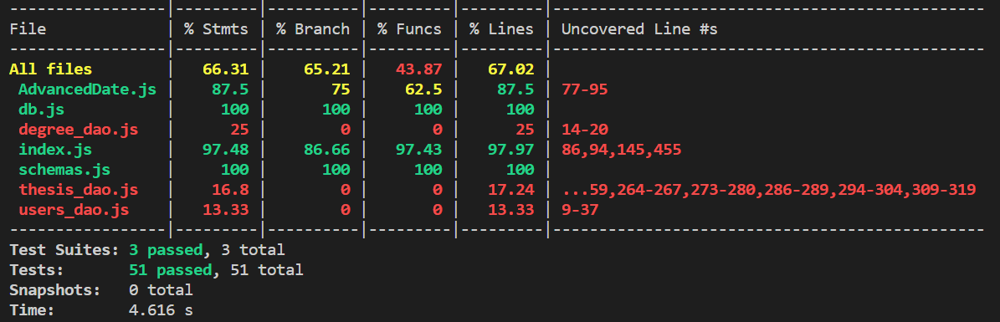

RETROSPECTIVE (Team 09)
=====================================

Sections:

- [process measures](#process-measures)
- [quality measures](#quality-measures)
- [general assessment](#assessment)

## PROCESS MEASURES 

### Macro statistics

- Number of stories committed vs. done: **9/5**
- Total points committed vs. done: **33/19**
- Nr of hours planned vs. spent (as a team): **103h 45m/109h 52m**

**Remember** a story is done ONLY if it fits the Definition of Done:
 
- Unit Tests passing
- Integration Tests passing
- Code review completed
- Code present on VCS
- End-to-End tests performed

### Detailed statistics

| Story  | # Tasks | Points | Hours est. | Hours actual |
|--------|---------|--------|------------|--------------|
| _#0_   |    23   |   -    |  40h       |  38h 21m     |
| 1      |    9    |   5    |  11h 35m   |  24h 5m      |
| 2      |    6    |   5    |  8h 50m    |  10h 56m     |
| 3      |    6    |   3    |  4h 25m    |  3h 35m      |
| 4      |    4    |   3    |  4h 55m    |  7h          |
| 5      |    4    |   3    |  6h 50m    |  9h 35m      |

- Hours per task average:

  - *average =* $\frac{6225}{59}$ = 105.51 minutes/task ~ **1.76 hours/task** (estimated)

  - *average =* $\frac{6592}{59}$ = 111.73 minutes/task ~ **1.86 hours/task** (actual)

- Standard deviation:

  - *Standard deviation →* $ \sigma = \sqrt{\frac{\sum_{i=1}^{n}(x_i - \bar{x})^2}{n}} $ = 117.7 minutes = **1.96 hours** (estimated)

  - *Standard deviation →* $ \sigma = \sqrt{\frac{\sum_{i=1}^{n}(x_i - \bar{x})^2}{n}} $ = 166.1 minutes = **2.7 hours** (actual)

- Total task estimation error ratio: 1 - sum of total minutes estimation / sum of total minutes spent = 1 - $\frac{6225}{6592} = 0.06$ = **6%**

  
## QUALITY MEASURES 

- Unit Testing:
  - Total hours estimated: **6h** (epic task) - **5h 50m** (subtasks sum)
  - Total hours spent: **5h 57m**
  - Nr of automated unit test cases: 5 suites (51 total tests)
  - Coverage:

    

- Integration Testing:
  - Total hours estimated: **6h** (epic task) - **3h 30m** (subtasks sum)
  - Total hours spent: **5h 27m**
  - Nr of automated unit test cases: 3 suites (51 total tests)
  - Coverage:

    

- E2E testing:
  - Total hours estimated: **10h**
  - Total hours spent: **1h 35m**

- Code review: 
  - Total hours estimated: **not available**
  - Total hours spent: **8h 15m**

*We monitored unit testing and integration testing activities using an epic task, resulting in two distinct estimations: one for the epic task itself and the other as the cumulative sum of all subtasks estimations.*

*The code review is not separately estimated because we introduced a work type called 'code review' and consequently, the estimation is already accounted for in the overall task estimated time.*

## ASSESSMENT

- What caused your errors in estimation (if any)?
  - **Lack of experience** → When we did the sprint planning, we realized that we didn't have a benchmark to accurately estimate the tasks.
  - **Wrong stories task subdivision** → The estimations are affected by errors because the tasks we created varied significantly in terms of the workload involved.
  - **Inexperience with a new framework** → We opted for a different framework instead of React-Bootstrap (in order to make a better UI). Underestimating the time required to become confident with it made slower each tasks implementation.

- What lessons did you learn (both positive and negative) in this sprint?
  - Effective sprint planning is crucial for improved work performance.
  - It's useful to plan regular meetings in order to have a fixed time to consult with the other team members.
  - We understood how to better deal with Github and all its potentials.

- Which improvement goals set in the previous retrospective were you able to achieve?
  - **Better communication** → We set up a Discord server because it's useful for holding regular meetings, especially because we live far apart and we have various different daily activities.
  - **Better accuracy** → We improved the task descriptions, aiming to provide more details to simplify the work for others.
  
- Which ones you were not able to achieve? Why?
  - **Equal work subdivision** → Due to our varied backgrounds, assigning tasks to ensure an equal time commitment is a challenging process.

- Improvement goals for the next sprint and how to achieve them (technical tasks, team coordination, etc.)
  - **Sprint planning enhancement** → As sprint planning is a critical and time-consuming activity, it's crucial to arrive with a clear idea of what needs to be done, preventing unnecessary time loss and ensuring effective story division, equal workload distribution and better work organization.
  - **Better work time management** → Despite everyone's commitments, it's important to evenly distribute the workload over the two weeks of the sprint to avoid having to complete all the tasks in the final days.

- One thing you are proud of as a Team!!
  - We are proud to see that the team's communication is improving day by day, even though it has not yet reached excellent levels. As we get to know each other's way of thinking better, team collaboration is becoming more efficient. We're also happy with the progress we made on the project.
