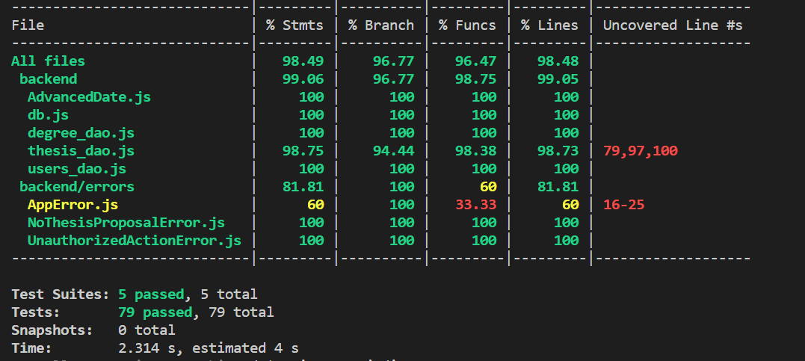

RETROSPECTIVE-1 (Team 09)
=====================================

### Sections:

- [process measures](#process-measures)
- [quality measures](#quality-measures)
- [general assessment](#assessment)

## PROCESS MEASURES 

### Macro statistics

- Number of stories committed vs. done: **4/5**
- Total points committed vs. done: **12/17**
- Nr of hours planned vs. spent (as a team): **117h 55m/112h 05m**

**Note:** The 5th story was implemented but not completed because it's missing the integration and unit testing.

**Remember** a story is done ONLY if it fits the Definition of Done:
 
- Unit Tests passing
- Integration Tests passing
- Code review completed
- Code present on VCS
- End-to-End tests performed

### Detailed statistics

| Story          | # Tasks | Points | Hours est. | Hours actual |
|----------------|---------|--------|------------|--------------|
| _#0_           | 39      | -      | 85h 00m    | 85h 55m      |
| 6              | 5       | 3      | 6h 50m     | 5h 55m       |
| 7              | 6       | 3      | 8h 50m     | 8h 15m       |
| 8              | 5       | 3      | 7h 25m     | 6h 05m       |
| 9 (_not done_) | 4       | 5      | 4h 30m     | 2h 45m       |
| 10             | 5       | 3      | 5h 20m     | 4h 55m       |

**Note:** #0 contains the hours spent for all the agile processes (planning, retrospective, meetings, etc.) and the
hours spent for fixing issues, improving based on feedback, refactoring, etc.

- Hours per task average:

  - *average =* $\frac{7075}{64}$ = 110.55 minutes/task ~ 1.84 hours/task ~ **1h 51m /task**  (estimated)

  - *average =* $\frac{6725}{64}$ = 105.08 minutes/task ~ 1.75 hours/task ~ **1h 45m /task**  (actual)

- Standard deviation: (TODO)

  - *Standard deviation →* $ \sigma = \sqrt{\frac{\sum_{i=1}^{n}(x_i - \bar{x})^2}{n}} $ = 1.85 (estimated)

  - *Standard deviation →* $ \sigma = \sqrt{\frac{\sum_{i=1}^{n}(x_i - \bar{x})^2}{n}} $ = 2.18 (actual)

- Total task estimation error ratio: 1 - sum of total minutes estimation / sum of total minutes spent = 1 - $\frac{7075}{6725} = 0.05$ = **5%**

  
## QUALITY MEASURES 

- All tests computed

  

- Unit Testing:
  - Total hours estimated: **9h**
  - Total hours spent: **6h**
  - Nr of automated unit test cases: 5 suites (79 total tests)
  - Coverage:

    

- Integration Testing:
  - Total hours estimated: **8h50m**
  - Total hours spent: **7h 05m**
  - Nr of automated unit test cases: 2 suites (55 total tests)
  - Coverage:

    
**Notes:** Currently, we have a big problem with our integration tests due to the external authentication service. Before
running them, we need to update the token used for authentication. This is a manual process that should be automated in
the next sprint but that explains why we can encounter some failures in the integration tests.
  
- E2E testing:
  - Total hours estimated: **8h30**
  - Total hours spent: **6h 45m**

- Code review: 
  - Total hours estimated: **5h 00m**
  - Total hours spent: **3h 35m**

## ASSESSMENT

- What caused your errors in estimation (if any)?
  - **Too generic tasks** → We have enhanced our estimation skills compared to previous sprints, resulting in a notably low estimation error ratio. However, our estimation errors arise from the fact that some tasks are too general and, consequently, challenging to estimate because we don't actually know, at the application level, what specific actions need to be taken

- What lessons did you learn (both positive and negative) in this sprint?
  - Efficient Git management plays a crucial role in the sprint process, as resolving conflicts can be time-consuming.
  - Subdividing tasks based on individual expertise allows us to concentrate on our strengths and minimizes time wastage.

- Which improvement goals set in the previous retrospective were you able to achieve?
  - **Sprint planning enhancement** → We have improved sprint planning by attempting a better subdivision of stories into tasks, addressing the issues identified in the previous sprint. The experience gained in the prior sprints has allowed us to understand the activities required for each new functionality.

- Which ones you were not able to achieve? Why?
-  **Better work time management** → Distributing the workload over the two weeks presents a challenge due to our varied schedules with different courses and activities to attend. Additionally, we must consider critical dependencies between tasks.

- Improvement goals for the next sprint and how to achieve them (technical tasks, team coordination, etc.)
  - **Better work time management** → Despite our commitments, we aim to expedite the planning process to start the work during the first weekend of the sprint, allowing us to complete the planned tasks with an earlier finish.
  - **Better work flow** → We would like to enhance the sequence in which we approach tasks to ensure the completion of committed stories within deadlines established in the planning.

- One thing you are proud of as a Team!!
  - Our commitment to continuous improvement is something that makes us proud. We actively seek feedback, learn from our experiences, and apply lessons learned to enhance our processes and outcomes. For example, we decided to enhance the mobile interface, even though it was already responsive, to better meet the needs of users.
