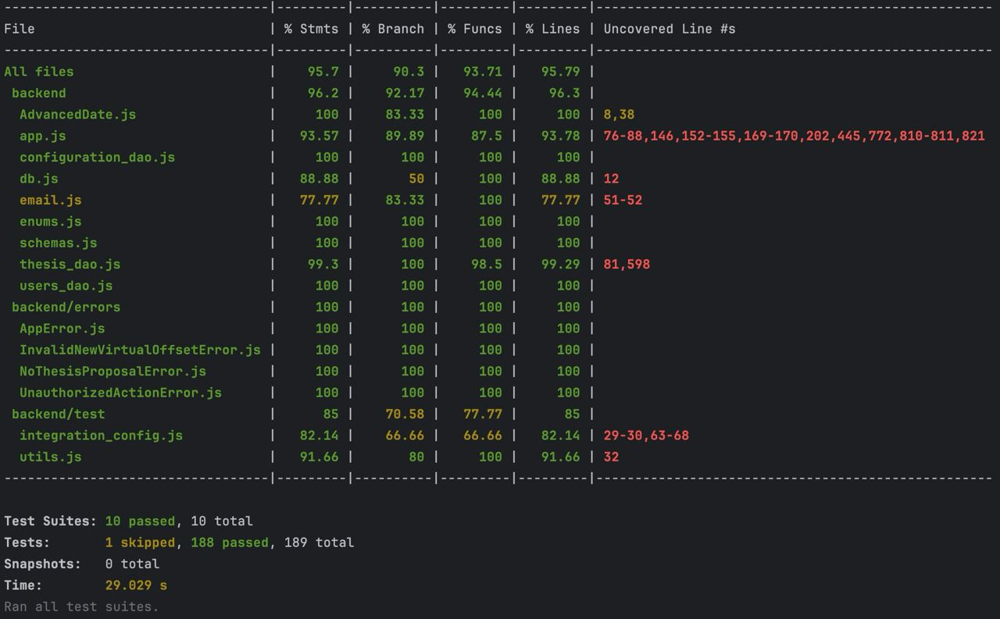
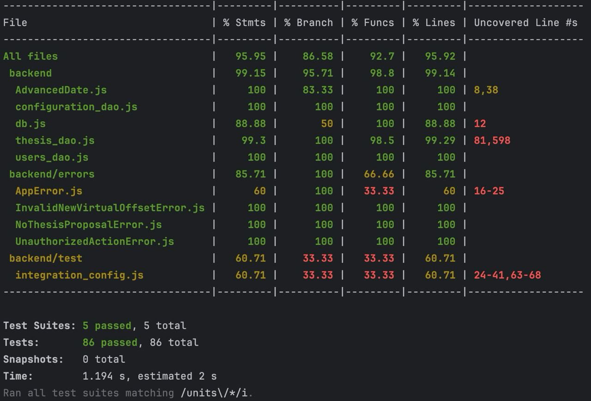
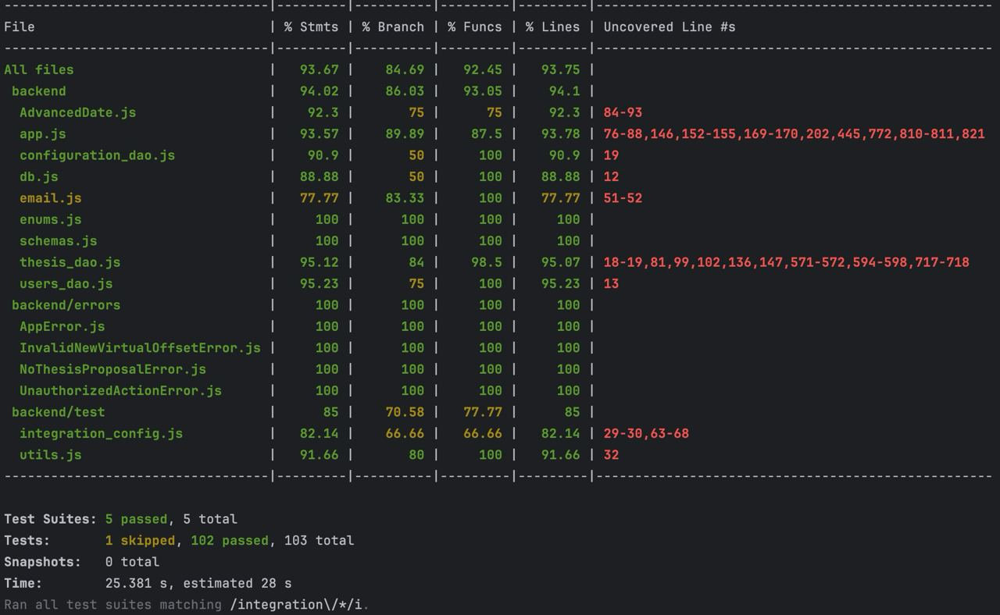
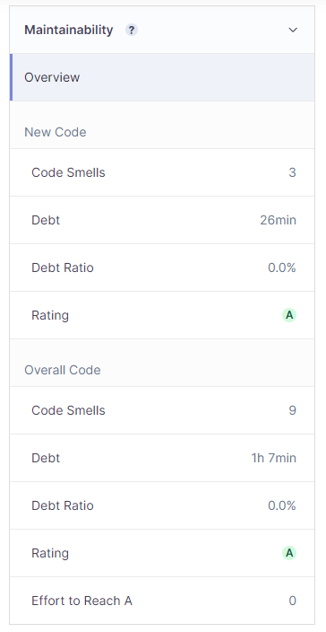
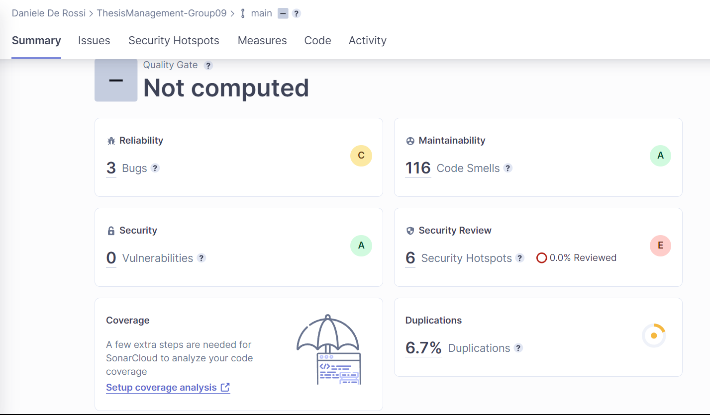
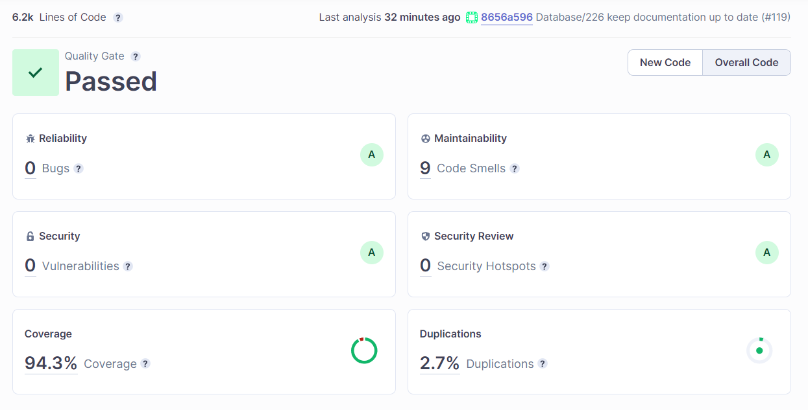

RETROSPECTIVE (Team 09)
=====================================

### Sections:

- [process measures](#process-measures)
- [quality measures](#quality-measures)
- [general assessment](#assessment)

## PROCESS MEASURES 

### Macro statistics

- Number of stories committed vs done: **4/4** 
- Total points committed vs done: **16/16**
- Nr of hours planned vs spent (as a team): **113h 05m/111h 50m**

**Note**: During the sprint, we abandoned 4 tasks as we realized they were related to future stories. These tasks are not considered in the estimated time, as they have been replaced with other tasks related to committed stories.

**Remember**  a story is done ONLY if it fits the Definition of Done:
 
- Unit Tests passing
- Integration Tests passing
- Code review completed
- Code present on VCS
- End-to-End tests performed

### Detailed statistics

| Story  | # Tasks | Points | Hours est. | Hours actual |
|--------|---------|--------|------------|--------------|
| _#0_   |   35    |    -   |   86h 05m         |    84h 50m         |
| 9 - Notify Application Decision  |    1    |   5    |  1h 30m   |    1h  1h       |
| 11 - Copy proposal               |    2    |   3    |    3h     |    3h 15m     |
| 12 - Archive proposal            |    5    |   5    |    7h     |    6h 45m     |
| 13 - Access applicant CV         |    9    |   3    | 1d 7h 30m |   2d 1h 10m   |
   
**Note 1:** #0 contains the hours spent for all the agile processes (planning, retrospective, meetings, etc.) and the
hours spent for:
- fixing issues
- improving based on feedback
- refactoring
- e2e testing
- sonar configuration

**Note 2:** In story 9, there is only one task as it was already started and not completed in the previous sprint. In particular the tests were missing, and they have been implemented in this sprint.

- Hours per task average:

  - *average =* $\frac{6785}{59}$ = 115 minutes/task ~ 1.92 hours/task ~ **1h 55m /task**  (estimated)

  - *average =* $\frac{6710}{59}$ = 113.73 minutes/task ~ 1.90 hours/task ~ **1h 54m /task**  (actual)

- Standard deviation:

  - *Standard deviation →*$\ sigma = \sqrt{\frac{\sum_{i=1}^{n}(x_i - \bar{x})^2}{n-1}}$ = **2.05 h** (estimated)

  - *Standard deviation →*$\ sigma = \sqrt{\frac{\sum_{i=1}^{n}(x_i - \bar{x})^2}{n-1}}$ = **2.06 h** (actual)

- Total task estimation error ratio: sum of total hours estimation / sum of total hours spent -1 = $\frac{6785}{6710} = 0.01$ = **1%**

  
## QUALITY MEASURES 

- **All tests computed**

  

- **Unit Testing**
  - Total hours estimated: **6h 30m**
  - Total hours spent: **5h 35m**
  - Nr of automated unit test cases : **5 suites (86 total tests)**
  - Coverage:
  
  

- **Integration Testing**
  - Total hours estimated: **12h**
  - Total hours spent: **9h 50m**
  - Nr of automated integration test cases : **5 suites (103 total tests)**
  - Coverage:

    

- **E2E testing**
  - Total hours estimated: **19h 55m**
  - Total hours spent: **17h 40m**

- **Code review**
  - Total hours estimated: **5h**
  - Total hours spent: **5h 10m**

- **Technical Debt management**
  - Total hours estimated: **8h 30m**
  - Total hours spent: **7h 55m**
  - Hours estimated for remediation by SonarQube: **~9h**
  - Hours estimated for remediation by SonarQube only for the selected and planned issues: **~9h**
  - Hours spent on remediation: **3h**
  - Debt ratio (as reported by SonarQube under "Measures-Maintainability"): **0.00%**

    

  - Rating for each quality characteristic reported in SonarQube under "Measures" (namely reliability, security, maintainability )

    **BEFORE THE SPRINT START**

    

    **AT THE END OF THE SPRINT**
  
    

## ASSESSMENT

- What caused your errors in estimation (if any)?
  - **Unexpected event** → unexpected refactor of the code was needed, however we have benefited from this change and the estimates weren't too far off.
  
- What lessons did you learn (both positive and negative) in this sprint?
  - **Importance of code quality** → A good code quality can help to understand it better and faster.

- Which improvement goals set in the previous retrospective were you able to achieve? 
  - **Better work flow** → in this sprint we focused on one story at a time trying to finish it before starting with the next one.
  
- Which ones you were not able to achieve? Why?
  - **Better work time management** → we have improved it especially for the planning part who has been done earlier. But, we can still do better to finish earlier.

- Improvement goals for the next sprint and how to achieve them (technical tasks, team coordination, etc.)
  - **Better work time management** → Enhance time management for earlier sprint task completion, possibly setting deadlines to ensure timely goal achievement.

- One thing you are proud of as a Team!!
  - We are proud of our communication and collaboration which has increased a lot since the beginning of the project allowing us to work more efficiently.
