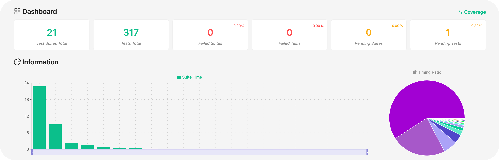
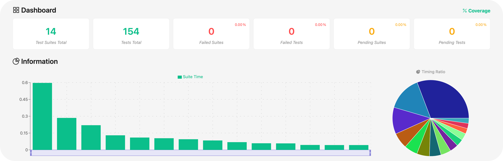
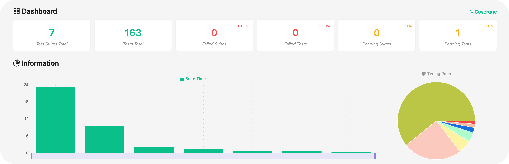
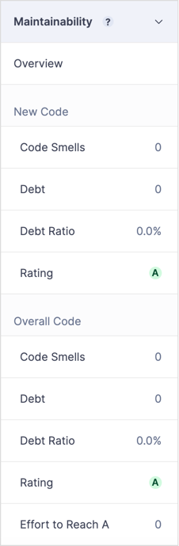
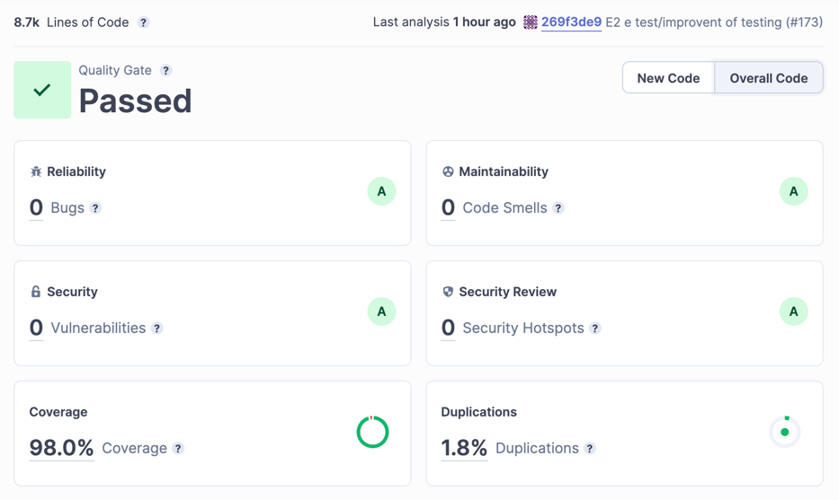

# RETROSPECTIVE (Team 09)
=====================================

### Sections:

- [process measures](#process-measures)
- [quality measures](#quality-measures)
- [general assessment](#assessment)

## PROCESS MEASURES 

### Macro statistics

- Number of stories committed vs done: **6/5**
- Total points committed vs done: **35/27**
- Nr of hours planned vs spent (as a team): **114h 30m/110h 35m** = **2w 4d 2h 30m**/**2w 3d 6h 35m**

**Note #0:** We were unable to complete a particular story as we arrived late, leaving insufficient time for automated end-to-end (e2e) tests, although the manual tests were conducted. Additionally, the mobile view had not been finalized at that point.

**Remember**  a story is done ONLY if it fits the Definition of Done:
 
- Unit Tests passing
- Integration Tests passing
- Code review completed
- Code present on VCS
- End-to-End tests performed

### Detailed statistics

| Story                                    | # Tasks | Points | Hours est. | Hours actual |
|------------------------------------------|---------|--------|------------|--------------|
| _#0_                                     |   31    |   -    |  7d 1h 55m |   6d 7h 50m  | 
| TM-14 (Notify Application)               |    5    |   3    |     3h 40m |      4h      |
| TM-26 (Insert student request)           |   10    |   8    |  1d 4h 40m |   1d 4h 50m  |
| TM-15 (Proposal expiration)              |    5    |   3    |     3h 50m |      3h 45m  |
| TM-27 (Secretary approve student request)|    8    |   8    |  1d 1h 10m |   1d 1h 15m  |
| TM-16 (Search archive)                   |   10    |   5    |  2d        |   1d 7h 10m  |
| TM-28 (Professor approve student request)|    8    |   8    |  1d 3h 15m |   1d 1h 45m  |
| Total                                    |   77    |  35    | 14d 2h 30m |  13d 6h 35m  |

**Note 1:** #0 contains the hours spent for all the agile processes (planning, retrospective, meetings, presentation preparation) and the hours spent for:
- documentation
- sonar issues management 
- improving based on feedback
- refactoring
- learning

 

- Hours per task average:

    - *average =* $\frac{6870}{77}$ = 89.22 minutes/task ~ 1.49 hours/task ~ **1h 29m /task**  (estimated)
    - *average =* $\frac{6635}{77}$ = 86.17 minutes/task ~ 1.44 hours/task ~ **1h 26m /task**  (actual)

- Standard deviation:

  - *Standard deviation →*$\ sigma = \sqrt{\frac{\sum_{i=1}^{n}(x_i - \bar{x})^2}{n-1}}$ = 1.61 h ~ **1h 37m** (estimated)

  - *Standard deviation →*$\ sigma = \sqrt{\frac{\sum_{i=1}^{n}(x_i - \bar{x})^2}{n-1}}$ = 1.62 h ~ **1h 37m** (actual)

- Total task estimation error ratio: sum of total hours estimation / sum of total hours spent -1 = $\frac{6780}{6635} -1$ ~ **2%**

## QUALITY MEASURES

- **All tests computed**

  

- **Unit Testing**
  - Total hours estimated: **4h 40m**
  - Total hours spent: **4h 25m**
  - Nr of automated unit test cases : **14 suites (154 total tests)**
  - Coverage:

  

- **Integration Testing**
  - Total hours estimated: **6h 10m**
  - Total hours spent: **5h 40m**
  - Nr of automated integration test cases : **7 suites (163 total tests)**
  - Coverage:

  

- **E2E testing**
  - Total hours estimated: **1d 5h 45m**
  - Total hours spent: **1d 5h 35m**

- **Code review**
  - Total hours estimated: **4h**
  - Total hours spent: **4h 05m**

- **Technical Debt management**
  - Total hours estimated: **1d 6h 25m**
  - Total hours spent: **1d 5h 10m**
  - Hours estimated for remediation by SonarQube: **1h 07m**
  - Hours estimated for remediation by SonarQube only for the selected and planned issues: **1h 07m**
  - Hours spent on remediation: **1h**
  - Debt ratio (as reported by SonarQube under "Measures-Maintainability"): **0.00%**

    

  - Rating for each quality characteristic reported in SonarQube under "Measures" (namely reliability, security, maintainability )

    **BEFORE THE SPRINT START**

    

    **AT THE END OF THE SPRINT**

    

## ASSESSMENT

- What caused your errors in estimation (if any)?
  - While some tasks may have taken longer than expected, the overall task estimation error ratio remains quite satisfactory at 2%. This indicates that we have gained valuable insights from past sprint experiences, allowing us to better allocate the appropriate amount of time for each task. Although there has been a slight increase in the error rate compared to the previous sprint (which stood at 1%), this change does not seem to be attributed to any specific reason. It's worth noting that continuous learning from past sprints has contributed to a generally accurate estimation process, with the team adapting and refining their approach over time.

- What lessons did you learn (both positive and negative) in this sprint?
  - **Importance of comment and descriptions in task**  → We've realized the importance of providing comments for every modification made to tasks and including descriptive information. This practice is crucial to assist others in understanding our actions, especially when there might be connections or correlations between different tasks.

- Which improvement goals set in the previous retrospective were you able to achieve? 
  - /
  
- Which ones you were not able to achieve? Why?
  - **Better work time management** → Despite our efforts, there is still potential for additional improvement for the future. However, it's important to note that we faced some personal challenges during this period, which resulted in certain slowdowns.

- Improvement goals for the next sprint and how to achieve them (technical tasks, team coordination, etc.)

  - /

- One thing you are proud of as a Team!!

  - Our **communication** has certainly improved, especially during a period when we were physically distant. Despite this distance, we managed to collaborate effectively. Additionally, we can definitely rely on the support of other team members, as we faced some personal challenges during this sprint, and we helped each other out. 

  - In the end we are proud of our project: 170+ GitHub pull requests closed, 8k+ lines of code and 3k+ telegram messages! 🚀
